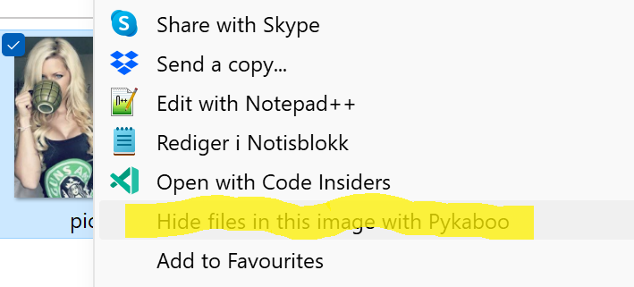

# Pykaboo

**Note:** This script currently supports Windows only.


This is a simple script that allows you to hide and unhide files in images using steganography.

Simply hold shift and right click the image file you
want to use for storage, and select "Hide with Pykaboo". Then just select all of the
files you want to hide.



The hide function in the provided script uses a technique to hide
data in the PNG metadata. Rather than embedding the data in the pixel values
of the image, it instead embeds the data in the metadata of the PNG file.

We use AES-256 encryption to encrypt the files, so you are safe if someone manages to understand that 
the files contain hidden information.

To unhide a file, simply right click the image you want to unhide and select "Unhide with Pykaboo".

## Setup Instructions

1. **Clone the Repository:**
   ```sh
   git clone https://github.com/yourusername/pykaboo.git
   cd pykaboo
   ```

2. **Create a Virtual Environment:**
   ```sh
   python -m venv venv
   ```

3. **Activate the Virtual Environment:**
   - On Windows:
     ```sh
     venv\Scripts\activate
     ```
   - On macOS and Linux:
     ```sh
     source venv/bin/activate
     ```

4. **Install the Required Dependencies:**
   ```sh
   pip install -r requirements.txt
   ```

5. **Run the Script:**
   ```sh
   python pykaboo.py
   ```

6. **Register Context Menu Options:**
   - To add the "Hide with Pykaboo" and "Unhide with Pykaboo" options to the context menu, execute the `pykaboo.reg` file:
     - Double-click the `pykaboo.reg` file.
     - Confirm the changes to the Windows Registry when prompted.

7. **Usage:**
   - To hide files, hold shift and right click the image file you want to use for storage, and select "Hide with Pykaboo".
   - To unhide files, right click the image you want to unhide and select "Unhide with Pykaboo".

